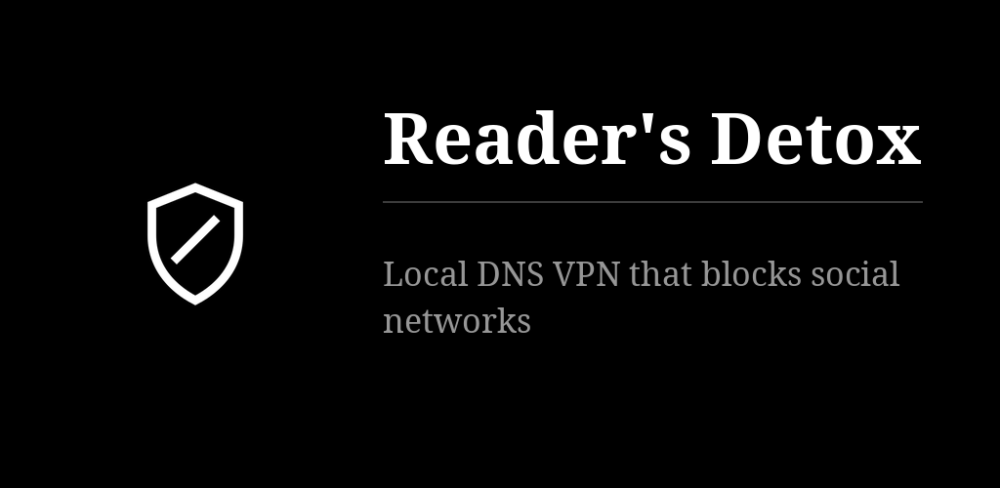
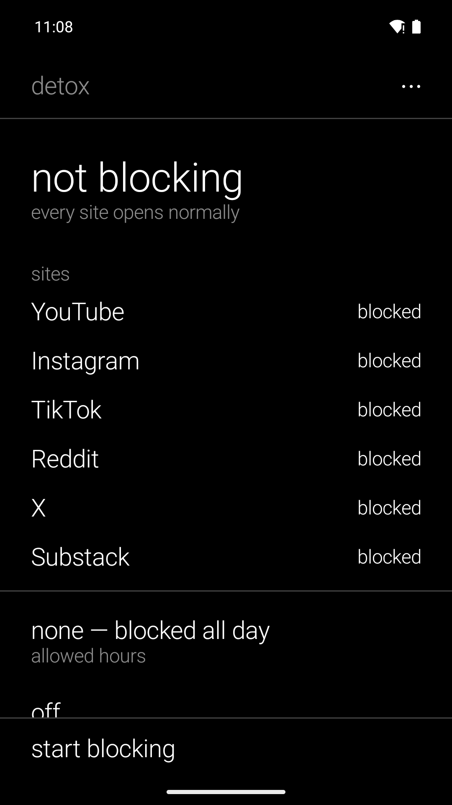

# Reader's Detox (formerly Social Detox)

Blocks social networks on the phone with a local DNS VPN. The filtering happens on the device:
no server sees your traffic, no account. The hours you set stay locked while blocking is on.
Works on IPv6-only carriers. A fork of [SocialBlocker](https://github.com/funkypitt/SocialBlocker)
without the password: a detox you impose on yourself, not a parental control — for a child's
device, use the original.

## Key points

* Choose the sites — YouTube, Instagram, TikTok, Reddit, X, Substack — then "start blocking".
  Android asks once for the VPN consent.
* Allowed hours: a list of ranges during which the sites open; none means blocked all day. A
  range ending earlier than it starts runs past midnight.
* While blocking, the sites, the hours and the maths switch are locked (only Substack stays
  free). To change them, stop first.
* Optional gate: five maths problems, each harder than the last, before blocking stops.
* Widget: the state in words, and a switch. Turning it off takes the app's path, maths included.
* Restarts after a reboot and an app update. For the strongest hold, make it the always-on VPN
  and allow it to run in the background; the app points to both settings.
* Limits: it takes the phone's single VPN slot, and you can lift it whenever you want. Turning
  the VPN off in the system settings counts as stopping.
* Black and white, text only, six languages. Installs beside the original SocialBlocker
  (different application id).

More detail: [docs/NOTES.md](docs/NOTES.md).

## Install


[](https://gallaz.ch/eink/#socialblocker-detox)

- **F-Droid** (recommended, updates arrive by themselves): add the repository from [gallaz.ch/eink](https://gallaz.ch/eink/#fdroid), or the address `https://funkypitt.github.io/fdroid-repo/repo` in F-Droid.
- **Obtainium**: tap the badge on the phone, or add `https://github.com/funkypitt/SocialBlocker-Detox` in Obtainium.
- **APK**: attached to the [latest release](../../releases/latest). No automatic updates.

All three deliver the same file, with the same signature.

## Build

```
./gradlew assembleDebug
```

minSdk 24, targetSdk 34. The UI is Kotlin + Jetpack Compose; the VPN service is the original Java.

## Crédits / Credits

Basé sur / Based on [SocialBlocker](https://github.com/funkypitt/SocialBlocker) by Pierre Gallaz, GPL-3.0-only.

© 2026 Pierre Gallaz. Développé avec [Claude Code](https://claude.com/claude-code) (Anthropic).
Licence GPL-3.0-only, voir `LICENSE`.

© 2026 Pierre Gallaz. Developed with [Claude Code](https://claude.com/claude-code) (Anthropic).
GPL-3.0-only licence, see `LICENSE`.

## Captures d'écran


